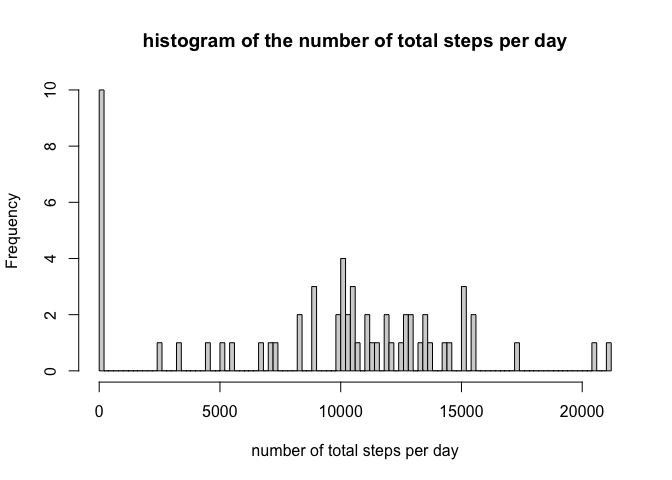
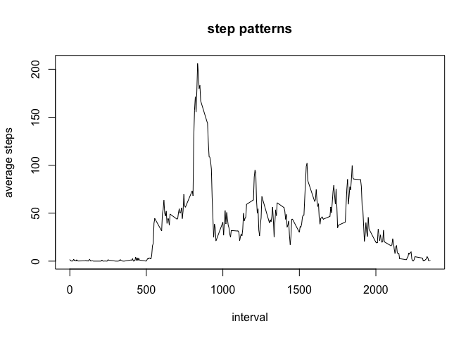
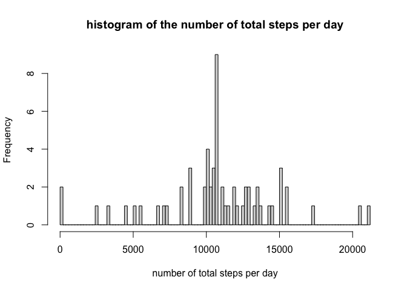
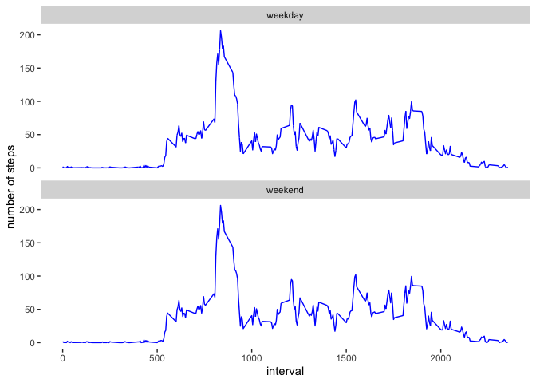

## Loading and preprocessing the data


```r
unzip('activity.zip')
activity<-read.csv('activity.csv')
head(activity)
```

```
##   steps       date interval
## 1    NA 2012-10-01        0
## 2    NA 2012-10-01        5
## 3    NA 2012-10-01       10
## 4    NA 2012-10-01       15
## 5    NA 2012-10-01       20
## 6    NA 2012-10-01       25
```
## What is mean total number of steps taken per day?
### sort out data

```r
library(dplyr)
```

```
## 
## Attaching package: 'dplyr'
```

```
## The following objects are masked from 'package:stats':
## 
##     filter, lag
```

```
## The following objects are masked from 'package:base':
## 
##     intersect, setdiff, setequal, union
```

```r
stepbydate<-select(activity, date, steps)%>%
        group_by(date)%>%
        summarize(totalstep=sum(steps, na.rm = T))
```

```
## `summarise()` ungrouping output (override with `.groups` argument)
```
### histogram and mean/median

```r
hist(stepbydate$totalstep,
     breaks = 100,
     xlab = "number of total steps per day",
     main = "histogram of the number of total steps per day");
```

<!-- -->

```r
meanstep<-mean(stepbydate$totalstep);
medianstep<-median(stepbydate$totalstep);
```
the mean total number of steps taken per day is 9354.2, and the median total number of steps taken per day is 1.0395\times 10^{4}

## What is the average daily activity pattern?
### pattern dataset

```r
pattern<-select(activity, interval, steps)%>%
        group_by(interval)%>%
        summarise(avgstep=mean(steps, na.rm = T))
```

```
## `summarise()` ungrouping output (override with `.groups` argument)
```
### plotting and max interval

```r
plot(pattern$interval,pattern$avgstep,type = "l",
     xlab = "interval",
     ylab = "average steps",
     main="step patterns")
```

<!-- -->
### find the interval with max avgsteps

```r
maxstep<-max(pattern$avgstep)
maxinterval<-pattern[pattern$avgstep==maxstep,]$interval
```
the interval with max average steps is 835.
 
## Imputing missing values
### summary of the data

```r
missingsteps<-sum(is.na(activity$steps));
missingdate<-sum(is.na(activity$date));
missinginterval<-sum(is.na(activity$interval));
```
### replace missing values in steps with mean steps and create a new dataset

```r
meansteptotal<-mean(activity$steps,na.rm = T)
activity_nareplace<-activity %>%
        mutate(nareplace=ifelse(is.na(steps),meansteptotal,steps))
```
### histogram

```r
stepbydatenarm<-select(activity_nareplace,nareplace,date)%>%
        group_by(date)%>%
        summarise(totalsteps=sum(nareplace));
```

```
## `summarise()` ungrouping output (override with `.groups` argument)
```

```r
 hist(stepbydatenarm$totalsteps,
      breaks = 100,
     xlab = "number of total steps per day",
     main = "histogram of the number of total steps per day");
```

<!-- -->

### calculate mean and median

```r
meanstep_narm<-mean(stepbydatenarm$totalsteps)
medianstep_narm<-median(stepbydatenarm$totalsteps)
```
the mean total number of steps taken per day after na removal is 1.0766\times 10^{4}, the median total number of steps taken per day after na removal is 1.0766\times 10^{4}.
The values are changed, but did not biased from original data a lot.

## Are there differences in activity patterns between weekdays and weekends?
### create new variable to indicate weekdays or weekend

```r
activity_weekdays<-mutate(activity, weekdays=weekdays(as.Date(activity$date)),
                          weekdayorend=ifelse(weekdays=="Saturday"|weekdays=="Sunday","weekend","weekday"));
activity_weekdays<-select(activity_weekdays,interval,steps, weekdayorend)%>%
        group_by(interval)%>%
        mutate(avgsteps=mean(steps,na.rm = T));
```

### plotting

```r
library(ggplot2)
g<-ggplot(activity_weekdays, aes(x=interval, y=avgsteps), fill='transparent')
        g+geom_line(color='blue')+
        facet_wrap(.~weekdayorend,ncol = 1)+
        labs(y='number of steps')+
                theme(panel.background = element_rect(fill = "transparent",colour = NA))
```

<!-- -->
